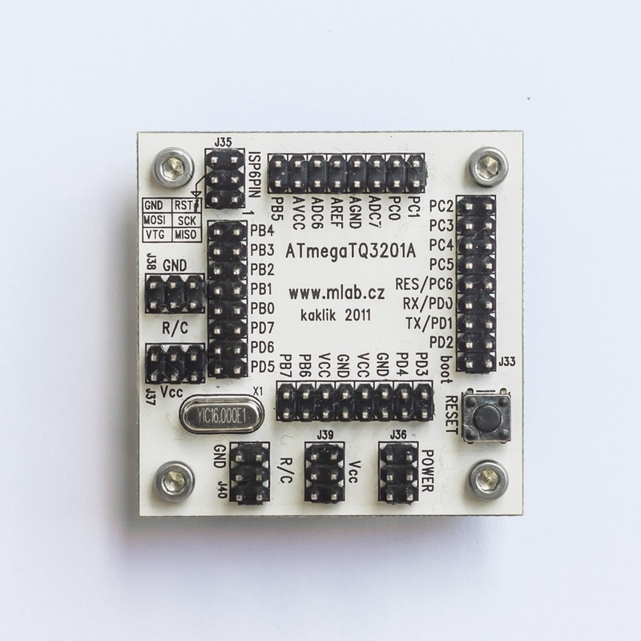
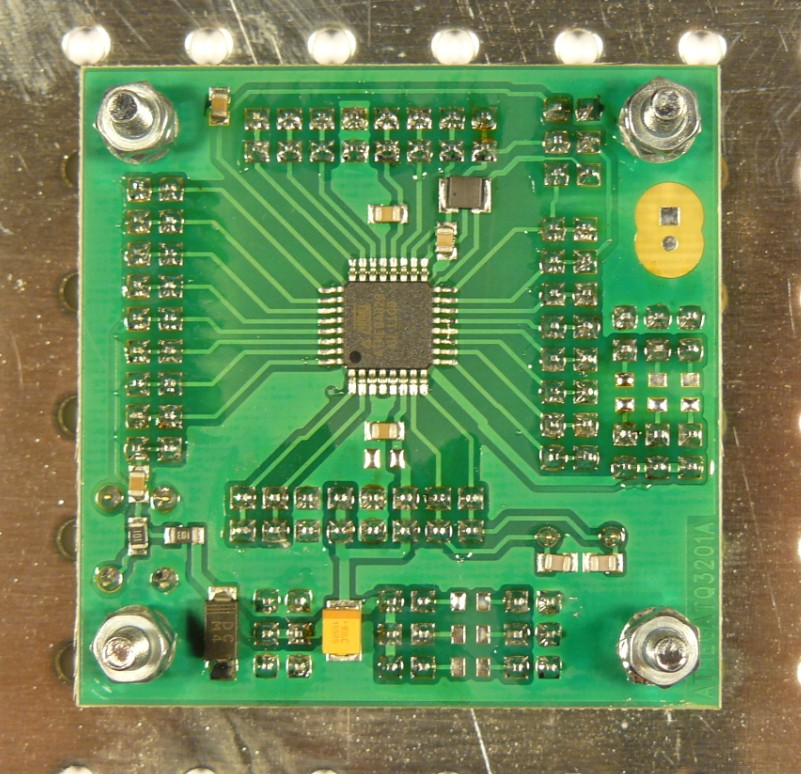

# ATmegaTQ3201 - ATmega microcontrolller in TQFP32 packages

## Overview

The ATmegaTQ3201 is a processor module designed for working with ATMEL processors in TQFP32 packages. This module includes a processor and is equipped with a RESET button and an ATMEL ISP 6 PIN programming connector. The module supports the use of a standard crystal or external clock.





## Technical Specifications

- **Power Supply:** 1.8V to 5.5V (depending on the processor used)
- **Processor:** ATmega8 / ATmega8L (or any other TQFP32 package)
- **Current Consumption:** 12mA at 8MHz with crystal
- **Dimensions:** 51x51x15mm (height above the carrier board)

## Features

- **Power Supply:** The module is powered via connector J33. Diode D1 protects against reverse polarity.
- **Clock Source Options:**
  - Internal RC oscillator (default setting, 1MHz)
  - External crystal oscillator with crystal X1
  - External RC oscillator (R3/C5)
  - External clock signal source on pin XTAL1
- **ISP Connector:** Standard 6-pin ISP connector for programming.
- **Reset Button:** Equipped with a RESET push button for easy reset functionality.

## Mechanical Construction

The module is a standard MLAB module with mounting corner posts for secure installation.

## Assembly and Initialization

### Assembly

- Use minimal solder for the processor. Pre-tin the pads if necessary and secure the processor by soldering two opposite legs first.
- Crystal can be soldered directly or mounted in precision sockets for easy replacement.
- In a pinch, the SMD inductor can be replaced with a jumper or a standard inductor, but this will affect the A/D converter noise performance.

### Components

- **Resistors:** R1 (100Ω), R2, R101, R102, R103 (10kΩ), R3 (not populated)
- **Capacitors:**
  - Ceramic: C4, C5 (22pF), C101, C102, C103 (10nF), C104 (470nF), C105 (4.7µF), C2, C3, C6, C7 (100nF)
  - Electrolytic: C1 (10µF/6.3V)
- **Inductors:** L1 (10µH)
- **Diodes:** D1 (M4)
- **Integrated Circuits:** U1 (ATmega8L-8AU)
- **Crystals:** X1 (specify frequency as needed)
- **Mechanical Parts:** Various jumpers, connectors, and screws as listed in the detailed documentation.

## Example Program

Here is a basic program to blink an LED using the ATmegaTQ3201A module:

```c
#define F_CPU 1000000UL  // 1MHz internal RC oscillator

#include <avr/io.h>
#include <util/delay.h>

// Delay function
void xDelay_ms(unsigned int Time) {
    for(; Time != 0; Time--) {
        _delay_ms(1);  // Library function with limited maximum delay
    }
}

int main() {
    DDRC |= 1;   // Set port PC0 as output
    for(;;) {    // Infinite loop
        PORTC |= 1;  // Set PC0 high
        xDelay_ms(500);  // Wait for 1/2 second
        PORTC &= ~1;  // Set PC0 low
        xDelay_ms(500);  // Wait for 1/2 second
    }
    return 0;
}

```

To program the chip with the above example, use the following command:

```
avrdude -p m8 -c picoweb -P lpt1 -U flash:w:BLIK_ATmega8.hex:a -E noreset
```

## Additional Information

For more details and updates, visit the MLAB website and the [MLAB wiki](https://wiki.mlab.cz/doku.php?id=cs:atmegatq32).
